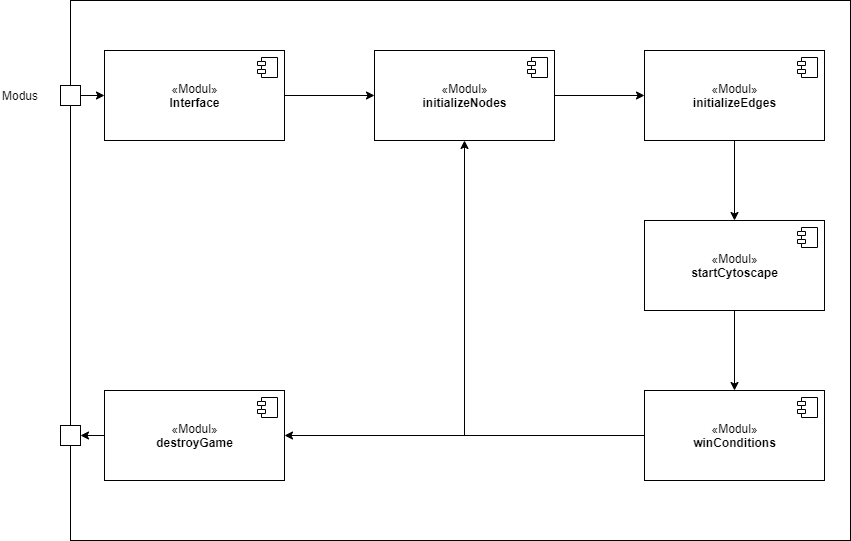
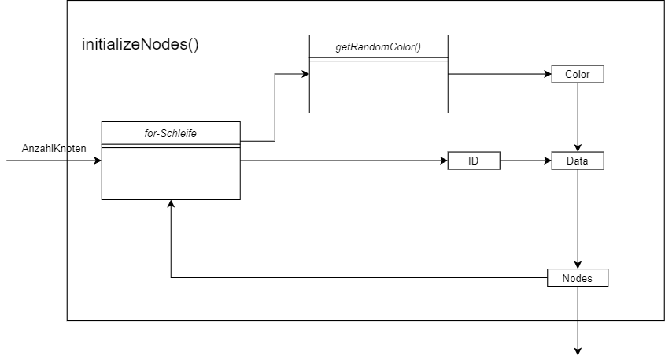
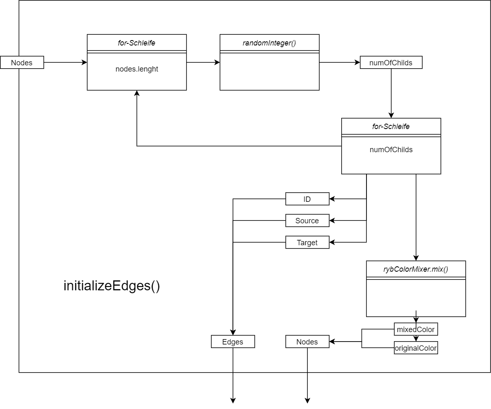
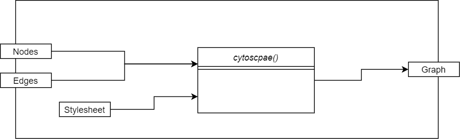

# **Causal Inference Game** #

Das 'Causal Inference Game' ist ein Browserbasiertes Spiel bei dem man das Prinzip der Kausalen Inferenz spielerisch erlernen kann.

Diese Dokumentation erfolgt nach der arc42-Vorlage.

## **1.Einführung und Ziele** ##

### 1.1 Aufgabenstellung ###

#### Was ist das 'Causal Inference Game'? ####

Bei diesem Programm handelt es sich um eine Anwendung, welche im Browser läuft. Dabei wird versucht durch die Nutzung von Graphen / Kanten / Knoten das abstrakte Prinzip der kausalen Inferenz spielerisch beizubringen. Das Spiel umfasst zwei Spielmodi und eine Seite zur Hilfestellung. DIe Spielmodi enthalten 3 zufällig generierte Level mit jeweils steigendem Schwierigkeitsgrad. In jedem Level gibt es die Möglichkeit Kanten zwischen den dargestellten Knoten zu ziehen. Wenn eine falsche Kante eingezeichnet wird verliert der Spieler ein Leben, was durch ein rotes aufleuchten des Bildschirms und den Verlust eines Herzicons dargestellt wird. Wenn eine richtige Kante eingezeichnet wird bleibt diese bestehen und der "Edges left counter" reduziert sich. Außerdem besteht die Möglichkeit ins Hauptmenü zurückzukehren und das Level aufzugeben ,durch drücken des entsprechenden Knopfes. Wenn das Spiel aufgegeben wurde, werden alle nicht eingezeichneten Kanten die fehlen sichtbar gemacht, sodass man die Lösung des Levels erkennen kann.
Wenn alle Leben verbraucht sind erscheint ein Game Over Overlay und man hat die Möglichkeit ins Hauptmenü zurückzukehren, um das Level neu zustarten. Falls man es schafft alle Kanten richtig einzuzeichnen erscheint ein neuer Knopf der zum nächsten Level führt, welches mehr Knoten und Kanten generiert.  

#### Features ####

* bietet 2 verschiedene Spielmodi je 3 Level
* zeigt das Prinzip der Kausalität 
* mehrere Level mit steigendem Schwierigkeitsgrad 
* "Aufgeben" Knopf
* Feedback bei falschen Eingaben
* Navigation zwischen Hauptmenü und Level

### 1.2 Qualitätsziele ###

* Funktionalität / Korrektheit

Es ist wichtig, das wenn man Kausale Inferenz beibringen möchte, man es auch richtig beibrngt. Es dürfen keine theoretischen Fehler auftreten.

* Bedienbarkeit

Da vorallem Schüler bzw. Kinder das Programm nutzten werden, darf das Interface und die Bedienung nicht zu komplex / kompliziert sein. Da ansonsten zusammen mit dem sehr theoretischen Thema der kausalen Inferenz schnell Frust enstehen kann.

* Effizienz

### 1.3 Stakeholder ###

Wer? | Bezug
------------- | --------------------------
Administratoren DLR SchoolLab |  
Schüler | -können Kausaltät kennen lernen   -einfache nicht aufgeblähte Erkärung   -intuitive Bedienung

## **2.Randbedingungen** ##

Eine kurze Zusammenfassung der Gegebenheiten mit denen wir gearbeitet haben

### 2.1 Technisch ###

Randbedingung | Erläuterungen, Hintergrund
------------- | --------------------------
Betrieb auf Windows Desktop Betriebssystemen | Schülerlabor des DLR ist mit dieser Hardware ausgestattet
Touchscreen Unterstützung wünschenswert | großer Bildschirm steht zur Vefügung ist perfekt dafür geeigent
Fremdsoftware kostenlos | kein Budget dafür vorgesehen

### 2.2 Organisatorisch ###

Randbedingung | Erläuterungen, Hintergrund
------------- | --------------------------
Team | Yasseen Salama und Jonas Bastisch, mit Betreung von Jakob, Philip, Caroline und Marianne
Zeitplan | Beginn: xx erster Prototyp: xx Fertiges Prjekt: xx
Vorgehensmodell | ...
Entwicklungswerkzeuge | ...
Versionsverwaltung | Git 

### 2.3 Konventionen ###

## **3.Kontextabgrenzung** ##

### 3.1 Fachlicher Kontext ###

#### Spieler ####

Das Programm wird von einer Pesron bedient. Zur Nutzung ist eine Maus oder eine Touchpad nötig. Der Spieler zieht Verbindungen zwischen den Knoten oder ändert die Farben der Knoten.

#### Cytoscape ####

[Cytoscape](https://js.cytoscape.org/)  ist ein Fremdsystem, welches dafür genutzt wird das den Graphen zu generieren. Dabei ist jeder Knoten und jede Kante des Graphen ein eigenes Element welches seperat angesprochen werden kann. Dadurch können wir uns die Zeit sparen eigenen Code zu schreiben, welcher den Graphen darstellt.

#### RYB-Color-Mixer ####

Wird genutzt um einfach die Farbmischung zu berechnen, anfags eigener Code dafür, haben uns dann aber dafür entschieden eine vorhandene Biblothek zu nutzen.

### 3.2 Technischer Kontext ###

Diagramm

Die Anbindung funktioniert über ein grafisches Frontend, welches durch Cytoscape zur Verfügung gestellt ist, die Entwicklung dieses war nicht Teil des Projektes. Dieses Frontend kann in jedem handelsüblichen Webbrowser genutzt werden

## **4.Lösungstrategie** ##

### 4.1 Einstieg ###

Wir schreiben das Programm in HTML + Javascript. Zunächst waren mehrere HTML-Seiten für jedes Level geplant, dies hat sich jedoch später als problematisch herausgestellt, weshalb wir auf eine Single-Page-Application umgestiegen sind. Das heißt das, das ganze Spiel auf einer HTML-Seite läuft.

### 4.2 Aufbau ###

Das Programm startet auf einem Hauptmenü, in welchem die beiden Spielmodi ausgewählt werden können, wenn einer der Modi ausgewählt wird die Funktion clickedOnMenu() ausgeführt, welche das Startmenü versteckt und Interface Elemente, wie Lebensanzeige und Leveldetails, auf dem Bildschirm anzeigt.

### 4.3 Tests ###

Um unser Programm zu testen haben wir verschiedene Stufen erreicht:
 1. zuerst haben wir einen Prototype gebaut der die Knoten darstellen kann mit zufällig generierten Farben 
 2. ein Prototyp der in der Lage ist Kanten einzeichnen zu können, ohne andere Funktionalität
 3. erster Mouds implementiert mit einem Level und keiner Progression
 4. zweiter Modus implementiert 
 5. Hosten eines Prototypens auf einer Website, welcher immer den aktuellen Entwicklungsstand hat. Menü + Interface 
 6. Levelsystem implementiert

### 4.4 Anbindung ###

## **5.Bausteinsicht** ##

### Spielüberblick ###

Das Programm kann grob in 6 Module unterteilt werden

Modul | Kurze Erklärung
------- | ----------------
Interface | generiert und versteckt bestimmte Interface Elemente die benötigt werden
initializeNodes | generiert Knoten mit zufälligen Farben
initializeEdges | generiert zufällige Kanten zwischen den norher generierten Knoten
startCytoscape | erzeugt aus den vorher generierten Knoten und Kanten einen interagierbaren Graphen
winCondition | kontrolliert Gewinnbedingung oder ob das Spiel verloren ist
destroyGame | führt das Programm in den Ursprungszustand zurück

### Interface ###

Nachdem der Modus ausgewählt wurde wird hier das Hauptmenü versteckt und andere Spielspezifische Interface Elemente geladen. Dazu gehören die Anzeige der Leben (Herzen), die Anzahl der noch einzuzeichnenden Kanten, das gerade aktive Level, ein Knopf der zurück zum Hauptmenü führt und ein Knopf, welcher das Spiel aufgibt und alle fehlende Kanten sichtbar macht. Zusätzlich dazu erscheint, wenn man den zweiten Modus auswählt, ein Menü in dem man eine Farbe auswählen kann.

### initializeNodes ###

Dem Modul wird ein Integer übergeben, welcher angibt wie viele Knoten generiert werden soll, daraufhin wird eine zufällige Farbe ausgewählt und eine ID zugewiesen.
Diese Daten werden zusamengefasst und dem Knoten angehangen. Dieser Knoten wird dann in das globale Array gepushed. Dieses wir dann für die nächsten Schritte verwendet.

getRandomColor() mischt das Array in dem die Farben gespeichert sind und nimmt dann immer das erste Element aus dem Array. Falls das gemischte Array leer ist wird ein neues erzeugt.

### initializeEdges ###

Das Modul nimmt die vorher erzeugten Knoten aus dem globalen Knotenarray und durchläuft diese einzeln. Es wird eine zufällige Zahl zwischen 0 und 3 (inclusive) ausgewählt diese Zahl gibt an wie viele Kanten von den jeweiligen Knoten ausgehen. Mit dieser Information werden die Edges generiert und mit einer ID ausgestattet, dabei kann es dazu kommen das mehrmals die gleiche Edge erzeugt wird, da das Ziel der Kante auch vollkommen zufällig ausgewählt wird, dies führt jedoch zu keinem weiteren Problem und kann also missachtet werden. Nun werden alle Farben der neu verbundenen Knoten mithilfe von RYBColorMixer.mix() gemischt und in mixedColor gespeichert, außerdem werden die Originalfarben dacor auch noch abgespeichert, sodass wir später darauf zurückgreifen können. Alle diese Farbdaten werden den entsprechenden Knoten angehangen.

### startCytoscape ###

Nun werden die generierten Knoten und Kanten verwendet um einen Graphen zu erzeugen. Außerdem wird dafür ein Stylesheet benötigt dieses ist fest einprogrammiert und kann im Programmcode geändert werden. In dem Sytlesheet geben wir an wie Die Knoten und Edges auszusehen haben. In unseren Fall geben wir an das mixedColor als Farbe der Knoten angezeigt werden soll, außerdem wird die ID des Knoten auch angezeigt und die Form der Knoten legen wir als Ellipse fest. Die Edges sind mit einer grauen Farbe belegt und die Form des Pfeils der Kanten legen wir als Dreieck fest. Das letzte was wir in dem Sytlesheet festlegen ist die Farbe der selber zu zeichnenden Kanten, welche wir auf Rot legen. Das Layout der Knoten wird auf einen Kreis eingestellt, sodass sich die Kanten nicht überlappen. Nun können wir durch die Funktion cytoscape() einen Graphen generieren mit dem der Spieler interagieren kann. Jetzt müssen nur noch die generierten Kanten versteckt werden, dies tun wir indem wir die Sichtbarkeit aller Kanten auf 0 setzen.

### winConditions ###

Hier wird nun knotrolliert ob das Spiel gewonnen oder verloren wird. Dazu benötigen wir einen Listener, welcher darauf reagiert wenn eine neue Kante eingezeichnet wird (ehcomplete). Wenn dies passiert kontrollieren wir ob diese neu eingezeichnete Kante im Kantenarray liegt. Falls das der Fall ist machen wir diese Kante sichtbar und reduzieren die Anzahl der Kanten die noch einzuzeichnen sind. Wenn dadurch die Anzahl auf 0 fällt ist das Level gewonnen, das heißt wir erhöhen das Level um 1, zerstören den jetztigen Graphen und generieren neue Knoten und Edges. Falls die eingezeichnete Kante nicht im Array liegt, lösen wir eine Animation aus die den Bildschirm rot aufblinken lässt und ziehen dem Spieler ein Leben ab. Wenn die Leben auf 0 fallen wird ein Overlay sichtbar, welches verhindert das neue Kanten eingezeichnet werden können.

Im Causal Intervention Modus ist eine zusätzlich Funktion implementiert, diese wird aktiviert wenn auf einen Knoten gedrückt wird. Die aus dem Farbmenü ausgewählte Farbe oder falls keine ausgewählt ist rot, wird an als Farbe des Knotens gespeichert, dann werden alle mit diesem Knoten verbundenen Knoten aktualisiert, das heißt die Farben werden neu gemischt. Außerdem werden alle veränderten Knoten jetzt als Stern angezeigt um sie besser unterscheiden zu können.

Wird noch genauer in Laufzeitschicht beschrieben.

## **6.Laufzeitsicht** ##

Hier wird gezeigt wie ermittelt wird ob eine eingezeichnete Kante richtig ist:

## **7.Verteilungssicht** ##
  evtl streichbar
Entwicklungsumgebung
Tetsumgebung

## **8.Konzepte** ##

* Kausalität: 
* Kausale Inferenz
* Directed acyclic graph:

## **9.Entscheidungen** ##

Nicht Ton sondern Farben

RYBColorMixer nutzen

Cytoscpae nutzen

Multipage vs. Single Page

Implementierung des Levelsystems

## **11.Risiken** ##

???

## **12.Glossar** ##
