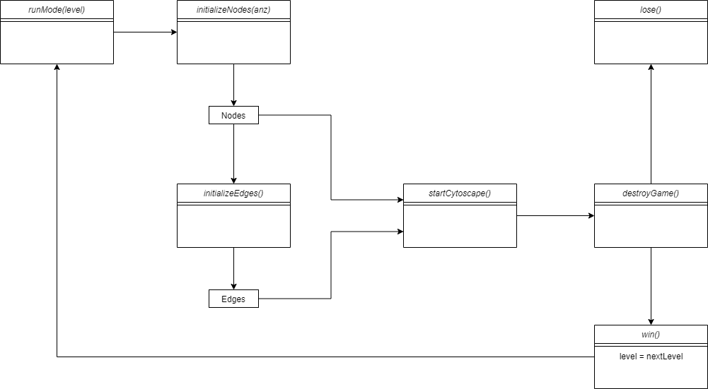

# **Causal Inference Game** #

Das 'Causal Inference Game' ist ein Browserbasiertes Spiel bei dem man das Prinzip der Kausalen Inferenz spielerisch erlernen kann.

Diese Dokumentation erfolgt nach der arc42-Vorlage.

## **1.Einführung und Ziele** ##

### 1.1 Aufgabenstellung ###

#### Was ist das 'Causal Inference Game'? ####
* empty
* 
#### Features ####

* bietet 2 verschiedene Spielmodi
* zeigt das Prinzip der Kausalität 
* mehrere Level mit steigendem Schwierigkeitsgrad 

### 1.2 Qualitätsziele ###

* Funktionalität / Korrektheit
* Bedienbarkeit
* Effizienz

### 1.3 Stakeholder ###

Wer? | Bezug
------------- | --------------------------
DLR | 
Schüler | -können Kausaltät kennen lernen   -einfache nicht aufgeblähte Erkärung   -intuitive Bedienung

## **2.Randbedingungen** ##

Eine kurze Zusammenfassung der Gegebenheiten mit denen wir gearbeitet haben

### 2.1 Technisch ###

Randbedingung | Erläuterungen, Hintergrund
------------- | --------------------------
Betrieb auf Windows Desktop Betriebssystemen | Schülerlabor des DLR ist mit dieser Hardware ausgestattet
Touchscreen Unterstützung wünschenswert | großer Bildschirm steht zur Vefügung ist perfekt dafür geeigent
Fremdsoftware kostenlos | kein Budget dafür vorgesehen

### 2.2 Organisatorisch ###

Randbedingung | Erläuterungen, Hintergrund
------------- | --------------------------
Team | Yasseen Salama und Jonas Bastisch, mit Betreung von Jakob, Paul, Caroline und Marianne
Zeitplan | Beginn: xx erster Prototyp: xx Fertiges Prjekt: xx
Vorgehensmodell | ...
Entwicklungswerkzeuge | ...
Versionsverwaltung | Git 

### 2.3 Konventionen ###

## **3.Kontextabgrenzung** ##

### 3.1 Fachlicher Kontext ###

#### Spieler ####

Das Programm wird von einer Pesron bedient. Zur Nutzung ist eine Maus oder eine Touchpad nötig. Der Spieler zieht Verbindungen zwischen den Knoten oder ändert die Farben der Knoten.

#### Cytoscape ####

[Cytoscape](https://js.cytoscape.org/)  ist ein Fremdsystem, welches dafür genutzt wird das den Graphen zu generieren. Dabei ist jeder Knoten und jede Kante des Graphen ein eigenes Element welches seperat angesprochen werden kann. Dadurch können wir uns die Zeit sparen eigenen Code zu schreiben, welcher den Graphen darstellt.

#### RYB-Color-Mixer ####

Wird genutzt um einfach die Farbmischung zu berechnen, anfags eigener Code dafür, haben uns dann aber dafür entschieden eine vorhandene Biblothek zu nutzen.

### 3.2 Technischer Kontext ###

Diagramm

Die Anbindung funktioniert über ein grafisches Frontend, welches durch Cytoscape zur Verfügung gestellt ist, die Entwicklung dieses war nicht Teil des Projektes. Dieses Frontend kann in jedem handelsüblichen Webbrowser genutzt werden

## **4.Lösungstrategie** ##

### 4.1 Einstieg ###

Wir schreiben das Programm in HTML + Javascript. Zunächst waren mehrere HTML-Seiten für jedes Level geplant, dies hat sich jedoch später als problematisch herausgestellt, weshalb wir auf eine Single-Page-Application umgestiegen sind. Das heißt das, das ganze Spiel auf einer HTML-Seite läuft.

### 4.2 Aufbau ###

Das Programm startet auf einem Hauptmenü, in welchem die beiden Spielmodi ausgewählt werden können, wenn einer der Modi ausgewählt wird die Funktion clickedOnMenu() ausgeführt, welche das Startmenü versteckt und Interface Elemente, wie Lebensanzeige und Leveldetails, auf dem Bildschirm anzeigt.

### 4.3 Spielstrategie ###

### 4.4 Anbindung ###

## **5.Bausteinsicht** ##

Wir versuchen hier jede genutzte Funktion zu erklären um eventuelle Veränderungen/ Verbesserungen zu ermöglichen.

## **6.Laufzeitsicht** ##

## **7.Verteilungssicht** ##

## **8.Konzepte** ##

* Kausalität: 
* Kausale Inferenz
* Directed acyclic graph:

## **9.Entscheidungen** ##

## **11.Risiken** ##

## **12.Glossar** ##
