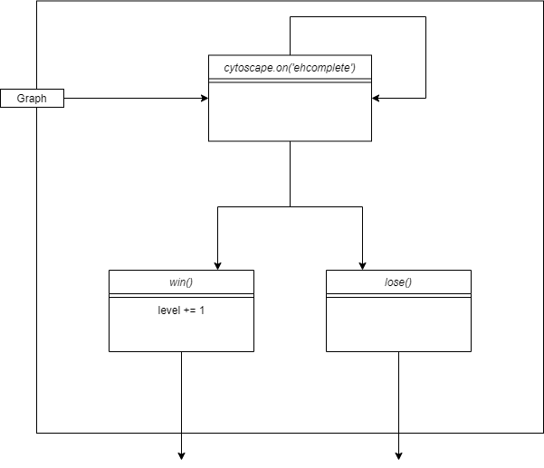

# **Causal Inference Game** #

Das 'Causal Inference Game' ist ein Browserbasiertes Spiel bei dem man das Prinzip der Kausalen Inferenz spielerisch erlernen kann.

Diese Dokumentation erfolgt nach der arc42-Vorlage.

## **1.Einführung und Ziele** ##

### 1.1 Aufgabenstellung ###

#### Was ist das 'Causal Inference Game'? ####

Bei diesem Programm handelt es sich um eine Anwendung, welche im Browser läuft. Dabei wird versucht durch die Nutzung von Graphen / Kanten / Knoten das abstrakte Prinzip der kausalen Inferenz spielerisch beizubringen. Das Spiel umfasst zwei Spielmodi und eine Seite zur Hilfestellung. DIe Spielmodi enthalten 3 zufällig generierte Level mit jeweils steigendem Schwierigkeitsgrad. In jedem Level gibt es die Möglichkeit Kanten zwischen den dargestellten Knoten zu ziehen. Wenn eine falsche Kante eingezeichnet wird verliert der Spieler ein Leben, was durch ein rotes aufleuchten des Bildschirms und den Verlust eines Herzicons dargestellt wird. Wenn eine richtige Kante eingezeichnet wird bleibt diese bestehen und der "Edges left counter" reduziert sich. Außerdem besteht die Möglichkeit ins Hauptmenü zurückzukehren und das Level aufzugeben ,durch drücken des entsprechenden Knopfes. Wenn das Spiel aufgegeben wurde, werden alle nicht eingezeichneten Kanten die fehlen sichtbar gemacht, sodass man die Lösung des Levels erkennen kann.
Wenn alle Leben verbraucht sind erscheint ein Game Over Overlay und man hat die Möglichkeit ins Hauptmenü zurückzukehren, um das Level neu zustarten. Falls man es schafft alle Kanten richtig einzuzeichnen erscheint ein neuer Knopf der zum nächsten Level führt, welches mehr Knoten und Kanten generiert.  

#### Features ####

* bietet 2 verschiedene Spielmodi je 3 Level
* zeigt das Prinzip der Kausalität 
* mehrere Level mit steigendem Schwierigkeitsgrad 
* "Aufgeben" Knopf
* Feedback bei falschen Eingaben
* Navigation zwischen Hauptmenü und Level

### 1.2 Qualitätsziele ###

* Funktionalität / Korrektheit

Es ist wichtig, das wenn man Kausale Inferenz beibringen möchte, man es auch richtig beibrngt. Es dürfen keine theoretischen Fehler auftreten.

* Bedienbarkeit

Da vorallem Schüler bzw. Kinder das Programm nutzten werden, darf das Interface und die Bedienung nicht zu komplex / kompliziert sein. Da ansonsten zusammen mit dem sehr theoretischen Thema der kausalen Inferenz schnell Frust enstehen kann.

### 1.3 Stakeholder ###

Wer? | Bezug
------------- | --------------------------
Administratoren DLR SchoolLab | brauchen gute Dokumentation, um eventuelle Verbesserungen / Änderungen durchführen zu können 
Schüler | * können Kausaltät kennen lernen  * einfache nicht aufgeblähte Erkärung  * intuitive Bedienung

## **2.Randbedingungen** ##

Eine kurze Zusammenfassung der Gegebenheiten mit denen wir gearbeitet haben

### 2.1 Technisch ###

Randbedingung | Erläuterungen, Hintergrund
------------- | --------------------------
Betrieb auf Windows Desktop Betriebssystemen | Schülerlabor des DLR ist mit dieser Hardware ausgestattet
Touchscreen Unterstützung wünschenswert | großer Bildschirm steht zur Vefügung ist perfekt dafür geeigent
Fremdsoftware kostenlos | kein Budget dafür vorgesehen

### 2.2 Organisatorisch ###

Randbedingung | Erläuterungen, Hintergrund
------------- | --------------------------
Team | Yasseen Salama und Jonas Bastisch, mit Betreung von Jakob, Philip, Caroline und Marianne
Zeitplan | Beginn: 06.11.2020 erster Prototyp: 08.01.2021  Fertiges Projekt: 05.02.2021
Vorgehensmodell | iterativ (Prototype dann Feedback)
Entwicklungswerkzeuge | Webstorm, Visual Studio Code, Webbrowser (Chrome, Edge) 
Versionsverwaltung | Git 

### 2.3 Konventionen ###
 
 * Dokumentation mithilfe des arc42-Templates
 * Dokumentation / Kommentare auf Deutsch
 * Funktionen / Variablen in Englisch
 * kanten werden mit den Knoten am Anfang und Ende beschrieben, zb. Kante zwischen Knoten A und E wird zu "ae"

## **4.Lösungstrategie** ##

### 4.1 Einstieg ###

Wir schreiben das Programm in HTML/CSS + Javascript.

### 4.2 Aufbau ###

Das Programm ist eine HTML-Seite mit zusätzlichem JavaScript. Man kann dabei grob in Interfacegenerierung und Aktualisierung, Graphengenerierung und Spiellogik unterteilen. Diese Unterteilung ist auch notwendig um immer neue Level zu generieren ohne dabei die Seite neu laden oder auf Feauteres verzichten zu müssen. Es wird einer von zwei Modi ausgewählt und dadurch das erste Level gestartet. Dabei wird das Interface je nach Modus entsprechend angepasst. Die Spiellogik kümmert sich dann darum zu kontrollieren ob richtige oder falsche Angaben gemacht wurden und ob dadurch das Level entweder gewonnen oder verloren wurde. Dementsprechend werden dann neue Interface-Elemente generiert.

### 4.3 Entwicklung ###

Bei der Entwicklung habne wir uns zunächst einmal überlegt wie wir den Graphen generieren und darstellen können. Wir haben uns dafür entschlossen Cytoscape zu verwenden was die Darstellungen des Graphen übernimmt (->Entscheidungen). Der erste erstellte Prototyp diente dazu um die Knotengenerierung zu testen, es wurden einfache Knoten mit zufäligen Farben dargestellt. Daraufhin wurde die Kantengenerierung getestet, das heißt Kanten zwichen den Knoten wurden eingezeichnet ohne jedoch irgendeinen Einfluss auf die Farben zu nehmen. Diese Testphase war vorallem nur für die Entwickler um generelle Funktionalität sicherzustellen.
Als nächstes wurde dann der erste Modus implementiert und zum eigenen testen zur Verfügung gestellt, dieser Prototyp hatte jedoch nur eine Level ohne jegliche Progression. Dadurch konnten iwr jedoch das grundlegende Spielprinzip festigen und erste Fehler ausbessern. Nach dieser Testphase beschlossen wir unseren aktuellen Stand immer auf einer Website zu hosten, auf die man jederzeit zugreifen kann. Dort haben wir dann den zweiten Modus und das Levelsystem implementiert, durch die einfache zugänglichkeit des Prototypens bekammen wir auch deutlich schenlleres Feedback, was unter anderem zu einer erweiterten Hilfe / Erklärung geführt hat.

### 4.4 Testphasen ###

1. Modultests (Knotengenerierung, Kantengenerierung, Graphengenerierung)
2. einzelne Modi (Zusamenführung der Module zu spielbaren Modus)
3. Modi zusammenführen zu einem Programm (Levelsystem + Hilfe)

Um unser Programm zu testen haben wir verschiedene Stufen erreicht:
 1. zuerst haben wir einen Prototype gebaut der die Knoten darstellen kann mit zufällig generierten Farben 
 2. ein Prototyp der in der Lage ist Kanten einzeichnen zu können, ohne andere Funktionalität
 3. erster Mouds implementiert mit einem Level und keiner Progression
 4. zweiter Modus implementiert 
 5. Hosten eines Prototypens auf einer Website, welcher immer den aktuellen Entwicklungsstand hat. Menü + Interface 
 6. Levelsystem implementiert

## **5.Bausteinsicht** ##

### Spielüberblick ###

Das Programm kann grob in 6 Module unterteilt werden

Modul | Kurze Erklärung
------- | ----------------
Interface | generiert und versteckt bestimmte Interface Elemente die benötigt werden
initializeNodes | generiert Knoten mit zufälligen Farben
initializeEdges | generiert zufällige Kanten zwischen den norher generierten Knoten
startCytoscape | erzeugt aus den vorher generierten Knoten und Kanten einen interagierbaren Graphen
winCondition | kontrolliert Gewinnbedingung oder ob das Spiel verloren ist
destroyGame | führt das Programm in den Ursprungszustand zurück

### Interface ###

Nachdem der Modus ausgewählt wurde wird hier das Hauptmenü versteckt und andere Spielspezifische Interface Elemente geladen. Dazu gehören die Anzeige der Leben (Herzen), die Anzahl der noch einzuzeichnenden Kanten, das gerade aktive Level, ein Knopf der zurück zum Hauptmenü führt und ein Knopf, welcher das Spiel aufgibt und alle fehlende Kanten sichtbar macht. Zusätzlich dazu erscheint, wenn man den zweiten Modus auswählt, ein Menü in dem man eine Farbe auswählen kann.

### initializeNodes ###

Dem Modul wird ein Integer übergeben, welcher angibt wie viele Knoten generiert werden soll, daraufhin wird eine zufällige Farbe ausgewählt und eine ID zugewiesen.
Diese Daten werden zusamengefasst und dem Knoten angehangen. Dieser Knoten wird dann in das globale Array gepushed. Dieses wir dann für die nächsten Schritte verwendet.

getRandomColor() mischt das Array in dem die Farben gespeichert sind und nimmt dann immer das erste Element aus dem Array. Falls das gemischte Array leer ist wird ein neues erzeugt.

### initializeEdges ###

Das Modul nimmt die vorher erzeugten Knoten aus dem globalen Knotenarray und durchläuft diese einzeln. Es wird eine zufällige Zahl zwischen 0 und 3 (inclusive) ausgewählt diese Zahl gibt an wie viele Kanten von den jeweiligen Knoten ausgehen. Mit dieser Information werden die Edges generiert und mit einer ID ausgestattet, dabei kann es dazu kommen das mehrmals die gleiche Edge erzeugt wird, da das Ziel der Kante auch vollkommen zufällig ausgewählt wird, dies führt jedoch zu keinem weiteren Problem und kann also missachtet werden. Nun werden alle Farben der neu verbundenen Knoten mithilfe von RYBColorMixer.mix() gemischt und in mixedColor gespeichert, außerdem werden die Originalfarben dacor auch noch abgespeichert, sodass wir später darauf zurückgreifen können. Alle diese Farbdaten werden den entsprechenden Knoten angehangen.

### startCytoscape ###

Nun werden die generierten Knoten und Kanten verwendet um einen Graphen zu erzeugen. Außerdem wird dafür ein Stylesheet benötigt dieses ist fest einprogrammiert und kann im Programmcode geändert werden. In dem Sytlesheet geben wir an wie Die Knoten und Edges auszusehen haben. In unseren Fall geben wir an das mixedColor als Farbe der Knoten angezeigt werden soll, außerdem wird die ID des Knoten auch angezeigt und die Form der Knoten legen wir als Ellipse fest. Die Edges sind mit einer grauen Farbe belegt und die Form des Pfeils der Kanten legen wir als Dreieck fest. Das letzte was wir in dem Sytlesheet festlegen ist die Farbe der selber zu zeichnenden Kanten, welche wir auf Rot legen. Das Layout der Knoten wird auf einen Kreis eingestellt, sodass sich die Kanten nicht überlappen. Nun können wir durch die Funktion cytoscape() einen Graphen generieren mit dem der Spieler interagieren kann. Jetzt müssen nur noch die generierten Kanten versteckt werden, dies tun wir indem wir die Sichtbarkeit aller Kanten auf 0 setzen.

### winConditions ###

Hier wird nun knotrolliert ob das Spiel gewonnen oder verloren wird. Dazu benötigen wir einen Listener, welcher darauf reagiert wenn eine neue Kante eingezeichnet wird (ehcomplete). Wenn dies passiert kontrollieren wir ob diese neu eingezeichnete Kante im Kantenarray liegt. Falls das der Fall ist machen wir diese Kante sichtbar und reduzieren die Anzahl der Kanten die noch einzuzeichnen sind. Wenn dadurch die Anzahl auf 0 fällt ist das Level gewonnen, das heißt wir erhöhen das Level um 1, zerstören den jetztigen Graphen und generieren neue Knoten und Edges. Falls die eingezeichnete Kante nicht im Array liegt, lösen wir eine Animation aus die den Bildschirm rot aufblinken lässt und ziehen dem Spieler ein Leben ab. Wenn die Leben auf 0 fallen wird ein Overlay sichtbar, welches verhindert das neue Kanten eingezeichnet werden können.

Im Causal Intervention Modus ist eine zusätzlich Funktion implementiert, diese wird aktiviert wenn auf einen Knoten gedrückt wird. Die aus dem Farbmenü ausgewählte Farbe oder falls keine ausgewählt ist rot, wird an als Farbe des Knotens gespeichert, dann werden alle mit diesem Knoten verbundenen Knoten aktualisiert, das heißt die Farben werden neu gemischt. Außerdem werden alle veränderten Knoten jetzt als Stern angezeigt um sie besser unterscheiden zu können.

Wenn das Spiel verloren wird wird destroyGAme ausgeführt ansonsten, generieren wir ein neues Level mit mehr Knoten und Kanten (initializeNodes)

Wird noch genauer in Laufzeitschicht beschrieben.

### destroyGame ###

Das letzte Modul was hier beschrieben wird ist dazu in der Lage das Spiel in den Ausgangszustand zurückzuführen, das heißt der Graph der im aktuellen Level bespielt wurde wird jetzt entfernt, die Levelvariable wird zurückgesetzt, und die Knoten und Kantenarrays werden geleert. Außerdem wird das Spielinterface versteckt und das Hauptmenü sichtbar gemacht. Dadurch können wir sicherstellen das, das Spiel immer vom gleichem Startpunkt aus generiert wird und so keine unerwarteten Fehler auftreten

## **6.Laufzeitsicht** ##

Hier wird gezeigt wie ermittelt wird ob eine eingezeichnete Kante richtig ist:

diagramm

In diesem Diagramm werden zwei Kanten eingezeichnet. Die erste zwischen Knoten A und D was als "ad" abgekürzt wird. Daraufhin wird kontrolliert ob diese Kante in dem zu Beginn generierten Kantenarray liegt, in diesem Fall ist das nicht so und false wird zurückgegeben, dadurch weiß der Graph nun das die Kante nicht eingezeichnet bleiben darf und entfernt diese, außerdem wird im Webbrowser eine Animation ausgelöst die als Fehler Feedback dient und ein Leben wirrd abgezogen. ES wird außerdem kontrolliert ob durch den Lebensverlust das Spiel verloren ist.
Die zweite eingezeichnete Kante "bc" ist diesmal korrekt also wird true zurückgegeben und es wird kontrolliert, ob dadurch alle Kanten eingezeichnet sind das ist nicht der Fall also bleibt die Kante einfach nur sichtbar.

## **8.Konzepte** ##

* Kausalität: 
* Kausale Inferenz
### Directed acyclic graph ### 

Ist eine spezille Art eine Graphens bei dem alle Kanten gerichtet sind und dabei keine Kreise entstehen. Diese Graphenart ist nötig um Kausalität wie in der Realität darzustellen, da wenn ein Kreis existieren würde, keine kausalen Beziehungen existieren können.

## **9.Entscheidungen** ##

### Spielprinzip ###

Die erste große Entscheidung die wir treffen mussten, bezog sich auf das grundlegene Spielprinzip, also wie wollen wir das abstrakte Prinzip der Kausalität spielerisch vermitteln? 
Die erste Möglichkeit ist es Knoten mit Tönen / Melodien zu füllen, das heißt wenn kausale Zusammenhänge zwischen den Knoten bestehn würden, würden sich auch die Melodien dementsprechend ändern. Ein großer Vorteil hiervon wäre das damit ein eigentlich geplannter 3 Modus umgesetzt werden könnte, der Causal ... Mode, in diesem gäbe es dann die Möglichkeit einen Knoten 'herauszurechnen', das heißt er würde die Daten der anderen Knoten nicht mehr beeinflussen. Nachteile dieser Variante wären ein sehr abstraktes Spielprinzip, da Kausalität an Tönen / Melodien zu erkennen für einen Menschen sehr schwer, außerdem sind unsere Musikkenntnise nicht sehr gut, weshalb eine Umsetzung sehr viel schwieriger wäre.
Die Alternative hierzu ist es die Knoten mit Farben zu füllen, kausale Beziehungen würden hierbei zu Farbmischungen führen. Das hätte zum Vorteil das die Logik hinter farbmischung schon für Kinder zugänglich sein sollte, außerdem ist diese Interaktion auch deutlich einfacher zu implementieren und kann viel Zeit sparen. Bei dieser Variante ist der dritte Modus jedoch nicht umzusetzten da das theoretische Prinzip dahinter nicht mit Farben umgesetzt werden kann.
Wir haben uns hier für die zweite Variante entschieden, da die Vorteile in unserem Fall das fehlen des dritten Spielmodus überschatten? .
 

### Graphimplementierung ###

Bei der Implementierung eines Graphens in Javascript hatten wir zunächst die Idee alles selbst zu implementieren. Dabei stoßen wir jedoch relativ schnell an unsere Grenzen, da keiner von uns vorher jemals Javascript genutzt hatte. Das heißt die Implementierung wäre sehr Zeitaufwändig gewesen. Ein Vorteil wäre aber bessere Anpassungsfähigkeit unseres Graphens an die speziellen Anforderung unseres Programms gewesen. 
Die zweite Möglichkeit welche wir schlussendlich auch genutzt haben ist die OpenSource Libary Cytoscape. Diese bietet ein Frontend an, welches Graphen darstellen kann mit denen man einfach und intuitiv interagieren kann. Zusätzlich dazu nutzen wir auch die Erweiterung Edgehandles um mit Cytoscape Kanten einzeichnen zu können. Das hat zum Vorteil das wir auf ein komplett programmiertes System zurückgreifen können und auch sicher sein können das alles seine Richtigkeit hat.

### Multipage vs. Single Page ###

Problem Multipage: Auf Mobilen Endgeräten (Android) funktioniert das Nutzen von Links in HTML-Seiten auf andere HTML-seiten im Ordnerverzeichnis in unseren Versuchen nicht, das heißt es bleibt keine andere Mögichkeit als alles in einer HTML-Seite zu vereinen. Leider verliert man dadurch natürlich ein wenig Überscihtlichkeit und erhält ein sehr langes Dokument. Jedoch wollten wir nicht auf Mobile Endgeräte verzichten, also entschieden wir uns für eine Single-Page-Application

## **11.Risiken** ##

### JavaScript ###

Ein Risiko was bestand ist das wir beide kaum Erfahrung mit JavaScript hatten, weshalb wir eher auf bereits vorhandene Bibliotheken zurückgegriffen haben anstatt diese Feautere selber zu schreiben. Dadurch konnten wir eventuelle Fehler die durch fehlende Erfahrung entstehen konnten zum großen Teil vermeiden und somit auch viel Zeit sparen.

## **12.Glossar** ##

Begriffe | Erklärung
---------|----------
Graph | eine abstrakte Struktur, die eine Menge von Objekten zusammen mit den zwischen diesen Objekten bestehenden Verbindungen repräsentiert
Kante | Verbindung zwischen zwei Knoten in einem Graphen
Knoten | Datenpunkt / Objekt in einem Graphen
DLR SchoolLab | 